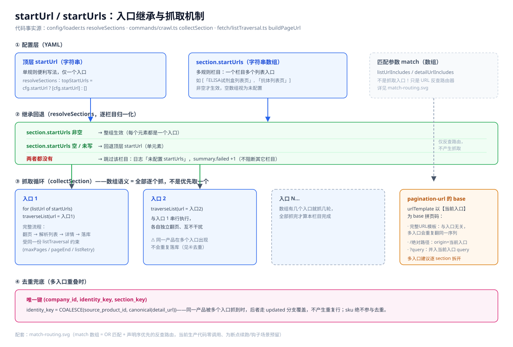
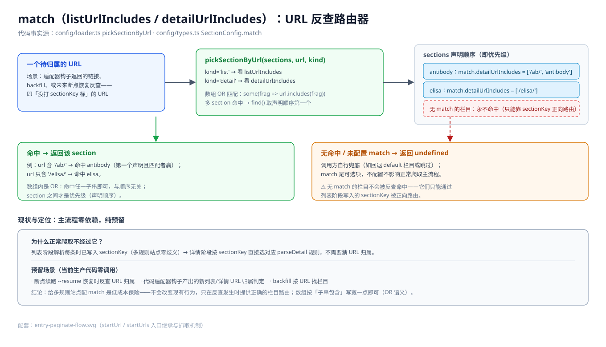

# 14 · 站点接入台账（62 站 = 58 竞品 + 4 自测）

> 更新：**2026-10-09 晚（精简重写版）**——旧版多轮增量流水账已废弃收敛为「一张 A 表 + 一张未通明细表」。**每行站点均带可点链接**（链接纪律：漏链接=无法点开排查=返工）。
> 口径：**A = YAML 已配且 validate error 0**；未配通全部在 §2.5（唯一明细表）；桶互斥，本表 + §2.5 为唯一真相源。
> 对账：**A 55（51 竞品 + 4 自测）+ 未通 7 = 62 ✓；竞品 51 + 7 = 58 ✓**。`pnpm validate`：57 站 error 0 / warn 2（warn = immocell / solarbio 真桩 STAGE_MISMATCH，即 §2.5 行 3/4）。

## 1. A 类 · 已配 55（51 竞品 + 4 自测）

> render 未标 = auto（SSR 优先、内容过少回退 browser）。入口 = startUrls 数（各入口独立翻页）。`⚠️` = crawl 需注意的关键参数。

| 站点 | 简称 | render | 入口 | 备注 |
|---|---|---|---|---|
| [www.procell.com.cn](https://www.procell.com.cn/search) | 普诺赛中文站 | auto | 6 | 自测基准；含 5 内容栏目（listOnly） |
| [www.procellsystem.com](https://www.procellsystem.com/search-category=cell-culture-media) | 普诺赛英文站 | auto | 14 | 自测；统一入口 `/search-category=<top>` |
| [www.elabscience.com](https://www.elabscience.com/search?category=flow-cytometry-antibodies) | 伊莱瑞特英文站 | ssr | 1 | 自测；`.search-list-pro` |
| [www.elabscience.cn](https://www.elabscience.cn/search-category=flow-cytometry-antibodies) | 伊莱瑞特中文站 | **browser** | 1 | **2026-10-09 配通**；⚠️ WAF 会话级拦截（非过盾）：会话过期重跑一次首页预热即可（state 已存 `.runtime/state/`）；probe 10 条 ✓；代码适配器已删（无必要） |
| [www.beyotime.com](https://www.beyotime.com/goods.do?method=lcode2&lcode2=001001) | 碧云天 | — | 9 | goods.do 单页全量大表（6162 行） |
| [www.xpbiomed.com](https://www.xpbiomed.com/Products/index.aspx?lcid=5) | 逍鹏生物 | — | 13 | |
| [learning.cytivalifesciences.com.cn](https://learning.cytivalifesciences.com.cn/product/category/cell-culture-and-fer) | Cytiva 思拓凡 | — | 14 | 自测 |
| [www.excellbio.com](https://www.excellbio.com/productcenter/list.aspx?lcid=272&scid=272) | 依科赛 | — | 30 | |
| [www.icellbioscience.com](https://www.icellbioscience.com/select_product?id=1&figure=0) | 赛百慷 | — | 10 | |
| [www.atcc.org](https://www.atcc.org/cell-products) | ATCC | — | 1 | |
| [www.ptglab.com](https://www.ptglab.com/results?category=&q=polyclonal&target=) | Proteintech | — | 5 | |
| [www.ua-bio.com](https://www.ua-bio.com/goodsList.html?typeld=11) | 斯达特 | — | 7 | ⚠️ 仅 `https://www` 可达 + WAF，须 browser + stealth |
| [www.seafrom.com](https://www.seafrom.com/mAb.html?ptype=16) | 同立海源 | — | 6 | |
| [www.oricellbio.cn](https://www.oricellbio.cn/reagents/mediums.html) | 赛业永奥 | — | 1 | 自测 |
| [www.liankebio.com](https://www.liankebio.com/product-category/fcm/fcm-antibody) | 联科生物 | — | 2 | |
| [www.zqxzbio.com](https://www.zqxzbio.com/Index/pro/fid/9/nums/2.html) | 中乔新舟 | — | 3 | |
| [www.jonln.com](http://www.jonln.com/?article/50.shtml) | 江莱生物 | — | 1 | |
| [www.beaverbio.com](https://www.beaverbio.com/products/index/952.html) | 海狸 | — | 2 | |
| [www.boxbio.cn](https://www.boxbio.cn/products/762/) | 盒子生工 | — | 2 | |
| [www.geruisi-bio.com](https://www.geruisi-bio.com/products/463/) | 格锐思 | — | 2 | |
| [www.fn-test.com](https://www.fn-test.com/product-cat/human-elisa-kit/) | 菲恩生物 | auto | 10 | `article.ft_product` + `link[rel=next]` |
| [abclonal.com.cn](https://abclonal.com.cn/polyclonal-antibodies/) | ABclonal | ssr | 1 | 详情 `script:contains(priceStr)` 正则提价 |
| [www.4abio.com](http://www.4abio.com/Product/ELISAkits-and-reagents/FC-kits) | 四正柏 | ssr | 1 | 单页无翻页 |
| [bioassaysys.com](https://bioassaysys.com/products/) | BioAssay Systems | ssr | 1 | WooCommerce，`page/{page}/` |
| [huabio.cn](https://huabio.cn/collections/primary-antibodies) | 华安生物 | browser | 1 | ⚠️ priceText 用 `#discount-price` 防脏串 |
| [ctcc.online](https://ctcc.online/CellLines/index.aspx?lcid=30) | 美森细胞 | browser | 6 | ⚠️ aspx 证书链 ssr 握手失败 → browser + ignoreHTTPSErrors |
| [www.sigmaaldrich.cn](https://www.sigmaaldrich.cn/CN/zh/products/cell-culture-and-analysis) | 默克 | browser | 1 | `[class*="tBodyRow"]`（emotion hash） |
| [www.cusabio.cn](https://www.cusabio.cn/catalog-30-1.html) | 华美生物 | — | 1 | 纯 SSR `catalog-30-{page}.html` |
| [www.capricorn-scientific.com](https://www.capricorn-scientific.com/en/shop/fetal-bovine-serum-fbs~c26) | Capricorn | — | 8 | 单页全量无翻页 |
| [www.fudancell.com](https://www.fudancell.com/sys-col-103/) | 富衡生物 | — | 1 | Fai 建站 `col.jsp?m426pageno={page}` |
| [www.stemcell.com](https://www.stemcell.com/products.html) | STEMCELL | ssr | 1 | 询价制无价格；去重键退化为 detail_url |
| [www.cytion.com](https://www.cytion.com/us/Cell-Lines/Human-cells) | Cytion | browser | 4 | ⚠️ 首屏约 40s，须 `CRAWL_BROWSER_MAX_WAIT=90000` |
| [bioxcell.com](https://bioxcell.com/in-vivo-antibodies) | Bio X Cell | browser | 1 | ⚠️ Algolia 点击累积翻页，须 `CRAWL_BROWSER_MAX_WAIT=150000` |
| [www.medchemexpress.com](https://www.medchemexpress.com/kits/cell-culture.html) | MCE | browser | 6 | |
| [www.sinobiological.com](https://www.sinobiological.com/search/by-category?keywords=protein&categoryCode=) | 义翘神州 | browser | 2 | ⚠️ CF 对 by-category 高频限流，crawl 需限速 |
| [bio.vazyme.com](https://bio.vazyme.com/products_4/1217037988630515712.html) | 诺唯赞 | browser | 187 | 三层结构 BFS 叶子入口；遗留：部分卡缺 detailUrl |
| [www.leinco.com](https://www.leinco.com/primary-monoclonal-antibodies/) | Leinco | browser | 16 | WP+Algolia |
| [www.promocell.com](https://promocell.com/fr_fr/products/cell-types/cancer-cells/) | PromoCell | browser | 24 | ⚠️ 代码适配器 `adapters/www.promocell.com.ts`（postParseList/Detail 补链接与价格） |
| [www.biolegend.com](https://www.biolegend.com/en-us/search-results?Keywords=) | BioLegend | browser | 1 | ⚠️ 空关键词全量 36002 条/1441 页，crawl 需限速防 CF |
| [www.abcam.com](https://www.abcam.com/en-us/products/primary-antibodies) | Abcam | browser | 1 | Tailwind 卡片 |
| [www.caymanchem.com](https://www.caymanchem.com/assays) | Cayman | browser | 1 | 详情字段待 probe 补 |
| [sciencellonline.com](https://sciencellonline.com/en/products-services/cell-culture-media/) | ScienCell | browser | 1 | Magento |
| [www.selleckchem.com](https://www.selleckchem.com/screening-libraries.html) | Selleck | browser | 1 | 筛选库页 |
| [www.basalmedia.com](https://www.basalmedia.com/) | 源培生物 | browser | 1 | 列表即全量字段 |
| [www.senbeijia.com](http://www.senbeijia.com/category.php?id=58) | 森贝伽 | browser | 1 | `goods.php` 详情链 + pagination-url |
| [www.lonsera.cn](https://www.lonsera.cn/list_11/) | 双洳生物 | browser | 1 | |
| [www.genscript.com](https://www.genscript.com/catalog-antibody-products.html) | 金斯瑞 | browser | 1 | |
| [www.raybiotech.com](https://www.raybiotech.com/elisa-kits-products/sandwich-elisa) | RayBiotech | browser | 1 | |
| [www.cas9x.com](https://www.cas9x.com/bdxb) | 海星生物 | browser | 1 | ⚠️ 服务目录无 SKU，crawl 排期默认跳过 |
| [www.promega.com.cn](https://www.promega.com.cn/products/immunoassay-elisa/lumit-immunoassays/) | Promega | browser | 1 | 手写配置（hub 页形态）；详情 D-async |
| [www.bdbiosciences.com](https://www.bdbiosciences.com/en-sg/search-results?query=Multicolor+Panels+and+Kits&tab=products) | BD Biosciences | browser | 1 | Algolia，gen+手修选择器；probe 70 条 ✓ |
| [www.thermofisher.com](https://www.thermofisher.com/search/browse/category/cn/zh/90217008) | 赛默飞 | browser | 1 | 手写配置；价格点击才异步 → 列表无价；翻页为按钮暂单页 |
| [www.miltenyibiotec.com](https://www.miltenyibiotec.com/US-en/products/by-cell-type/t-cells-products.html?query=:relevance:Cell-type:T%20cells) | Miltenyi | browser | 1 | **2026-10-09 配通**；probe 25 条 ✓；详情 D-async（occ 接口待人工回填） |
| [www.rndsystems.com](https://www.rndsystems.com/search?search_type=products&keywords=Quantikine%20ELISA&species=Human) | R&D Systems | auto | 1 | **2026-10-09 配通**；Drupal `.search_result` 卡片；probe 10 条 ✓；详情价格 `parseDetail.api`（drupal_ajax HTML 片段）待回填 |
| [www.novoprotein.com.cn](https://www.novoprotein.com.cn/product-list?id=10) | 近岸蛋白 | browser | 1 | **2026-10-09 配通**；⚠️ 表格由 api/summary 异步填充（waitSelector 等 tbody）；条目源=隐藏 SEO 锚点（有 detailUrl 无文本，name/sku 详情补）；更多分类入口追加 `/product-list?id=N`；probe 10 条 ✓ |

## 2.5 未配通 7 站 · 唯一明细表

> 组成：5 个 `_` 桩（`_` 前缀，crawl/validate 不加载）+ 2 个真 YAML 桩（immocell / solarbio）。每站只出现一次。

| # | 站点（链接=尝试过的列表页） | 桶 | 卡点 / 尝试记录（2026-10-09） | 下一步 |
|---|---|---|---|---|
| 1 | [www.cellsignal.com](https://www.cellsignal.com/browse?tab=product&qs=filter_engaged)（`_` 桩） | 🙋 C | 沙箱出口对该域 **TCP 断连**（curl 000 双模式实测）无法自抓；页面是 Vue SPA（auto 抓到 565KB 壳 → NEED_MORE_HTML，**须 browser 渲染**，引擎现已自动回退）；你的过盾会话已存（17KB） | **你**（机器能通）跑：`pnpm gen-site --domain www.cellsignal.com --list-url "https://www.cellsignal.com/browse?tab=product&qs=filter_engaged" --render browser` |
| 2 | [www.acrobiosystems.com](https://www.acrobiosystems.com/category/kits-assay-reagents/elisa-kit)（`_` 桩） | 🙋 C | **开 VPN 不通、关 VPN 可通**（你 17:15 实测，等关 VPN 再试）；已收 dump 是 fail 页（68KB 无产品链接，不可作配置依据） | **你**：关 VPN 后确认可达 → 我 gen-site（browser） |
| 3 | [immocell.com](https://immocell.com/)（真桩） | 🙋 C | 你确认 **VPN 开关均不可达**（2026-10-09）；会话文件 36B 疑空 | 挂起待你侧网络恢复后叫我 |
| 4 | [www.solarbio.com](https://www.solarbio.com/)（真桩） | 🙋 C | 你确认 **VPN 开关均不可达**（2026-10-09） | 同上 |
| 5 | [www.corning.com](https://ecatalog.corning.com/life-sciences/b2b/CN/zh/%E8%A1%A8%E9%9D%A2/%E7%BB%86%E8%83%9E%E5%A4%96%E5%9F%BA%E8%B4%A8ECM/c/extracellularMatricesEcms)（`_` 桩） | 🔧 B | **2026-10-09 转机**：品类页 200（35 产品）！但结构 = 品类 → **产品族**（`section.family-result` ×9）→ 族页下钻才见产品列表，与「列表→详情」不同构 | **我**（B 类攻坚）：收集 9 个族页的产品列表 URL 作 startUrls（Matrigel 族页已实测 200） |
| 6 | [www.beckman.com](https://www.beckman.com/reagents/coulter-flow-cytometry/antibodies-and-kits)（`_` 桩） | ⏸️ D | 你已过盾（会话 16:43 落盘），headless 复测仍 CF 盾（有头+会话才可达）；产品列表是 Coveo 异步搜索（E 形态） | 按纪律不逆向接口 → 挂起；解禁需你明确要求 |
| 7 | [www.dojindo.cn](https://www.dojindo.cn/products/category/13)（`_` 桩） | ⏸️ D | 复核维持：可见表格行**无 `<a>` 详情链**；页内 `#/goodsDetails?gid=N` 全是**空文本 hash 隐藏链**（HTTP 不发 # 片段，详情不可 fetch）；`product_list` API 分类参数返空 | 挂起（接口形态 E） |

## 3. 引擎升级（2026-10-09，commit 91e3174）

- **卡页守卫**（`listTraversal.ts`）：翻页天花板防御——站点「号称大几万」但天花板后吐末页副本；连续 2 页新增 0 条（`onPage` 回传身份键 `canonical(detailUrl)`，不回传则守卫不介入）即停翻该入口，消灭白翻 maxPages + 假覆盖。
- **拆分类约定**（`listTraversal.splitThreshold`，顶层/section 可配，默认 5000，显式 `0` 关）：单入口条数超阈值时 crawl 提示按分类/筛选拆多个 startUrls。分类 URL 自动发现为后续增强（未排期）。
- **gen-site 四项加固**：① 诊断前置（`diagnoseBlocked`：挑战信号/兜页链接极少 → 明确报「被拦需过盾」，不再伪报 NEED_MORE_HTML）；② auto 通道 SPA 壳/被拦 → 自动 browser 重试一轮；③ `buildModelHtml` 窗口选取改容器 class 重复度（预算 60K→100K）；④ batch 失败行自动 browser 重试一次。
- 全量回归：typecheck ✓ / vitest 418 例 ✓ / validate 57 站 error 0 ✓。

## 4. 判定纪律（保持有效，勿回退）

1. 任何站下「不可接」结论前**必须跑 `pnpm diagnose --domain <d>` 贴对照表**，且**必须取得你浏览器可达性确认**——「用户能开而代码说被拦」一律按用户视角重判（实证：PromoCell / 逸漠 / CST / elabscience.cn，后者本轮证实为 curl 指纹级 403、浏览器畅通且可配）。
2. **不主动逆向接口**（Coveo / hash SPA / 签名接口形态 E 一律挂起）。
3. 提到站点必带可点击链接；台词条目只写「事实 + 归类 + 下一步（谁做什么）」。
4. YAML 是代理/渲染/翻页的唯一裁决方；代码适配器只加钩子不替换 YAML，**无必要不新增**（elabscience.cn 适配器已按此删除）。

## 4.1 「说我被拦、用户说能开」的真 bug（2026-10-05 修 5 处 + 2026-10-08 修 1 处，勿回退）

| # | bug | 现象 | 现状 |
|---|---|---|---|
| 1 | `isAutoPassableChallenge` 只按**文案**判自动放行 | 命中 `cf-mitigated: challenge` 响应头时 `matched` 不含文案 → 判「不可自动放行」→ **重试循环整段被跳过**，托管挑战一刀切判死 | 已修（头 + 文案两路都认）+ 5 例回归 |
| 2 | `assessChallenge` 状态码分支用 `HTTP 403` 覆盖 `matched` | 已判明的文案信号（`Just a moment...`）被抹成无信息量状态码，上层据此误判 | 已修（优先带真实命中特征，无信号才回退状态码） |
| 3 | `stealthInitSource` 把硬件特征**硬编码**成 8 核 / 8G、plugins 造 4 个、mimeTypes 造 4 个 `application/pdf` | 反检测脚本自己造破绽：真实 Chrome 是 16 核 / plugins 5 / mimeTypes 2，数量与内容双不自洽 | 已改为**只补缺不篡改**（内核有真值一律不碰）。验收 = `pnpm diagnose` 指纹体检 |
| 4 | `fetchPage` 的 auto 回退把 `ChallengeError` **排除在外** | `mode==='auto'`（默认值！）撞上托管挑战时**直接抛错判死**；可 `cf_clearance` 得由盾页 JS 写 cookie，静态通道再试也过不去 | 已修（`auto` 一律回退 `browserFetch`；`ssr` 模式仍严格抛错，诊断口径不受影响） |
| 5 | `traverseList` 的浏览器分支**没有挑战处理** | 翻页只 `goto` + `settle` → 首页拿到挑战页 HTML → 解析 0 条按「末页」break → 一轮「跑完、日志干净、库空」的静默失败 | 已修（`waitForChallengePass` 与 `browserFetch` 共用：重导航 + cookie 复用 + 人工过盾）；过不掉抛 `ChallengeError` |
| ⑥ | `stealthContextOptions` 设了 context 级 **`extraHTTPHeaders`**（伪造 `sec-ch-ua: 124` 等） | 附加到 context **每个请求（含跨域 XHR）** → CORS preflight 失败 → **接口渲染站列表整块渲染不出**（Leinco hits=0、康宁/BD 同批误判「无法配」） | **已修**（删除该字段，54fe192；浏览器原生头自洽）。**教训：「只补缺不篡改」同样适用于 HTTP 头** |

> **姿势事实**：同一 Beckman 页，裸 headless → 403，带 stealth 默认通道 → 200。裸浏览器结果不能当「这站不可接」的依据。

## 5. 挑战检测 SOP（`fetch/challenge.ts`，防误报防漏报）

> 原则：**判定只在 fetchPage 内做一次**（`assessChallenge`），上层禁止用旧正则重复分类。

| 信号层 | 内容 | 判定 |
|---|---|---|
| ① 响应头 | `cf-mitigated` / `x-px-*` / incapsula，逐条 key+value 匹配 | high |
| ② 特异文案 | innerText 含 just a moment / request unsuccessful / 滑动验证等 | high |
| ③ 宽泛文案 | unusual traffic / security check / g-recaptcha（正常页也可能有） | 需 domWidget 或「无内容」佐证 |
| ④ 状态码 | 403/405/406/412/429/451/503 | high（优先于软拦） |
| ⑤ 反向放行 | 中/弱信号 + 正文 ≥500 字符 + 无验证控件 | falseAlarm（正常页） |
| ⑥ 软拦 | <200 字符空壳 | suspicious |

关键：browser 通道用 innerText + 响应头 + DOM 控件查询；**innerText 优先**（Promega 把 `.g-recaptcha` 写进富文本白名单 JSON，裸匹配 HTML 必误报）。ssr 通道特异文案也只降 medium、宽泛词有实质内容放行。

## 5.5 代理口径（2026-10-04 · 用户口径：**YAML 是唯一裁决方**）

> **根因**：Chromium **不认** `http_proxy` 环境变量（只读 Windows 系统代理），Node fetch 也不认。开了 VPN 不显式配置，抓取仍以本机 IP 直连。

| 规则 | 说明 |
|---|---|
| **配了就走、没配就直连** | 唯一开关是站点/栏目 YAML 的 `proxy:`。**代码层没有任何域名/地区黑名单**（`resolveProxy()` 已删） |
| **按站/栏目开代理** | YAML 顶层 `proxy: '${CRAWL_PROXY}'`（推荐）或完整 URL；section 级可覆盖 |
| **双通道生效** | browser 走 `newContext({proxy})`；ssr 走 Playwright `APIRequestContext`（`ssrFetchViaProxy`） |

配置写法见 `config/sites/_template.yaml` §1.1 与 `.env.example` 的 `CRAWL_PROXY`（填**完整 URL**）。

## 6. 命令速查

```bash
pnpm sweep --all                              # 全站可达性扫描（ssr/browser 两轮）
pnpm diagnose --domain <d>                    # 反爬归因唯一入口（多通道对照 + 指纹体检）
pnpm probe --domain <d> --sample 3 --detail 2 # YAML 验证（标准流程）
pnpm validate                                 # 全站 YAML 结构校验（error 级退出码 1）
pnpm gen-site --domain <d> --list-url <url>   # 草稿生成（回验 hard 拒写盘）
pnpm crawl --domain <d>                       # 正式抓取（--resume 断点续跑）
```

## 7. 配置效率经验（YAML 坑速查）

- **YAML 正则一律单引号风格**：双引号串 `\d` 是非法转义；内嵌单引号写 `''`。
- **cheerio 定位含变量的 script**：`sel: 'script:contains(priceStr)'`；**`:has()` 不可用**；emotion hash 类名可用 `[class*="语义"]` 稳定匹配。
- **aspx 证书链不全的站必须 `render: browser`**。
- **三种产品入口口径**：① 无列表页 → 导航找落地页、startUrls 写最终列表页；② 有直接列表页 → 即入口；③ 只有搜索框 → 宽泛关键词搜全量。
- **多表/多卡布局不统一的站，先找「形态一致」的统一入口**（procellsystem 改用 `/search-category=<top>` 一次配全 14 栏目；fn-test 真列表在归档页）。
- **站点特有字段名会被 validate 判拼写告警**：宁可不配，靠详情 `captureRest` 兜底进 row。
- **WAF 会话级拦截站**（elabscience.cn 型）：先逛一次首页种 Cookie → `.runtime/state/<host>.json` → browserFetch 自动复用；过期重预热即可，无需适配器。
- **隐藏 SEO 锚点站**（novoprotein 型）：可见行无链接但页面有 `a[href^=…]` 空文本锚点时，条目源用锚点（`$self` + regex 抽 sku），name/sku 详情补。

### 翻页两大类（用户最终口径）

| 两大类 | 形态 | 引擎实现 | 现网实例 |
|---|---|---|---|
| **① SSR 直出列表翻页** | 翻页 = 换 URL，每页固定条数 | `pagination-url`（urlTemplate）或 `pagination-html` | cusabio / 富衡 / procellsystem / fn-test / elabscience.cn（`&page=N`） |
| **② CSR 接口渲染** | 主体由接口在浏览器拼出 | ②-a 点击分页：`pagination-html`+`nextSelector`；②-b 滚动：`scroll-api`；配 `waitSelector`（**内容级**）+ 必要时 `CRAWL_BROWSER_MAX_WAIT` | bioxcell（Algolia 累积）/ novoprotein（el-pagination）/ leinco |

> 口径补充：`strategy: none` 只是「单页兜底」声明（listOnly 栏目继承到 URL 翻页模板时必须显式关停）。
> 判定口诀：**看换页时 URL 变不变 + 不变时内容由谁拼**。

## 8. 机制速查图

- ——`startUrl`/`startUrls` 继承回退；数组 = 全部逐个抓，各入口独立跑完整翻页；`urlTemplate` 以当前入口为 base。
- ——`listUrlIncludes`/`detailUrlIncludes` 是反查路由器而非抓取入口。

## 9. 下一步排序

1. **C 类等你 4 站**：cellsignal（跑 §2.5 行 1 的 gen-site 命令）、acrobiosystems（关 VPN 后确认）、immocell / solarbio（网络恢复后叫我）。
2. **B 类攻坚（我）**：corning 族页下钻（§2.5 行 5）。
3. **A 类收尾（我）**：新配站 `probe --detail 2` 校准详情字段；miltenyi / rndsystems 详情接口回填；之后分批 crawl。
4. **引擎候选**：`crawl.ts:1074` 空身份键静默丢行——建议累计丢弃数收尾 warn（防「日志干净库空」复发）。
5. 维持纪律：E 形态不逆向；cas9x crawl 默认跳过；fn-test 大分类全量跑（`--max-pages` 调大）。
